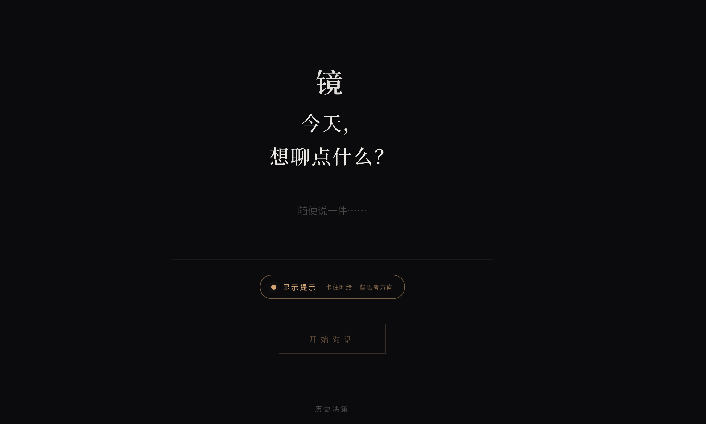

# 镜 · MindMirror

> 一个帮你"把事想完整"的对话式思考工具。
> 你说一件事，它通过提问帮你梳理，最后给你一份**决策快照**。

不是聊天机器人，不给建议，不替你做决定 —— 它只负责把你脑子里那些没说清楚的东西问出来。

**▶️ 在线体验（无需安装，打开即用）：https://jing-mindmirror.pages.dev/**

> 这是部署在 Cloudflare Pages 上的现成版本，方便你直接试一试。
> 在线版的对话数据存储在 Cloudflare（D1 数据库），仅供体验，请勿写入敏感信息；想让数据完全留在自己机器上，按下面的步骤本地部署即可。

<p align="center">
  
</p>

## 它长什么样

- **起始屏**：写下今天卡住的事
- **对话屏**：AI 一次只问一个问题，按"事实 → 情绪 → 价值 → 行动"四个阶段推进
- **决策快照**：聊完生成一张可保存/截图的卡片，记录你想清楚的结论
- **历史决策**：本地存档，随时回看自己的思考轨迹

**本地自托管**时，数据全部存在你自己电脑上的 JSON 文件里（`prototype/data/`），不上传任何服务器；[在线体验版](https://jing-mindmirror.pages.dev/)则把数据存在 Cloudflare D1（仅供试用）。

---

## 本地跑起来

### 0. 你需要

- Node.js ≥ 18（自带 `fetch`，无需其他依赖）
- 一个 LLM 的 API Key（默认用 [DeepSeek](https://platform.deepseek.com)，便宜且中文好；也兼容 OpenAI / 硅基流动 / Moonshot 等任何 OpenAI 协议接口）

### 1. 克隆 + 装依赖

```bash
git clone https://github.com/zecynx/Jing-MindMirror.git
cd Jing-MindMirror/prototype
npm install
```

### 2. 配置 API Key

```bash
# macOS / Linux
cp .env.example .env

# Windows (PowerShell)
Copy-Item .env.example .env
```

打开 `.env`，填入你的 API Key：

```env
LLM_BASE_URL=https://api.deepseek.com
LLM_API_KEY=sk-你的密钥
LLM_MODEL=deepseek-chat
```

> 想换别的模型？`.env.example` 里写了 OpenAI / SiliconFlow / Moonshot 的现成例子，取消注释改一下就行。

### 3. 启动

```bash
npm start
```

看到这个就成了：

```
🔮 镜·MindLens V2 服务器已启动
   地址: http://localhost:3000
   LLM:  deepseek-chat @ https://api.deepseek.com
   API:  ✅ 已配置
```

浏览器打开 **http://localhost:3000**，就可以开始用了。

---

## 目录结构

```
Jing-MindMirror/
├── prototype/              # 代码主体（npm 命令都在这里跑）
│   ├── server.js           # Express 入口
│   ├── routes/             # API 路由（chat / conversations / system）
│   ├── prompts/            # Prompt 工程层
│   ├── public/             # 前端（纯静态：index.html / app.js / styles.css）
│   ├── db.js               # JSON 文件数据库
│   └── data/               # 你的对话数据（自动创建，已 gitignore）
└── archive/docs-v1-v4/     # 历史 PRD 归档
```

整个前端是**纯静态**的（一个 HTML + 一个 JS + 一个 CSS），后端是个薄薄的 Express 代理 + JSON 文件存储 —— 没有数据库、没有构建步骤、没有框架。

---

## Docker（可选）

```bash
cd prototype
docker build -t mindmirror .
docker run -p 3000:3000 --env-file .env mindmirror
```

---

## 常见问题

**Q：API Key 会泄露吗？**
不会。`.env` 已在 `.gitignore` 里，永远不会被提交。Key 只在你本地机器上、由后端代理调用 LLM。

**Q：我的对话数据存哪里？**
- **本地自托管**：`prototype/data/` 下三个 JSON 文件（`users.json`、`conversations.json`、`events.json`），备份/迁移直接拷走这个目录就行。
- **在线体验版**：存在 Cloudflare D1 数据库里（不在你本地），仅供试用，别写入敏感信息。

**Q：能不能换成本地模型？**
可以，任何兼容 OpenAI Chat Completions 协议的接口都行（Ollama、LM Studio、vLLM 等），改 `LLM_BASE_URL` 就完事。

---

## License

**PolyForm Noncommercial License 1.0.0**

简单说：
- ✅ 个人使用、学习、研究、改着玩 —— 随便
- ✅ 学术/教学/非商业的分享与二次开发 —— 随便
- ❌ **不允许任何商业用途**，包括但不限于：作为产品对外提供、向用户收费、内部工具节省成本、改名重新发布卖钱

如果你想商用，请通过 GitHub Issues 联系作者单独谈授权。

完整协议文本见 [`LICENSE`](./LICENSE)（或 https://polyformproject.org/licenses/noncommercial/1.0.0/）。
